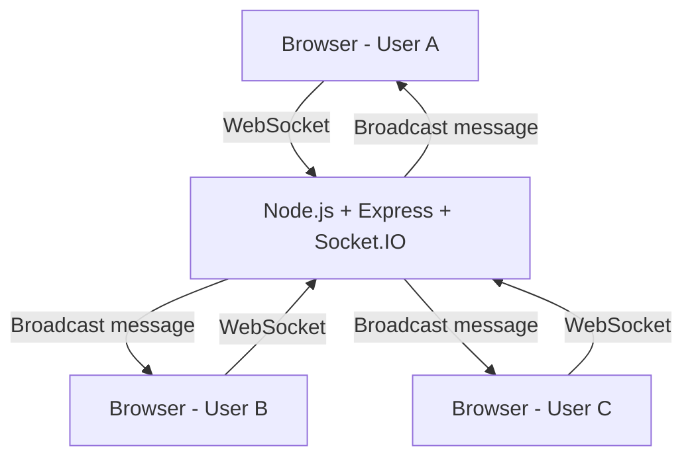
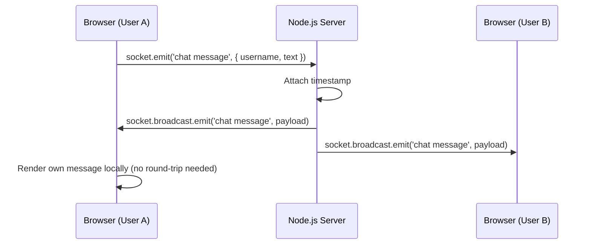
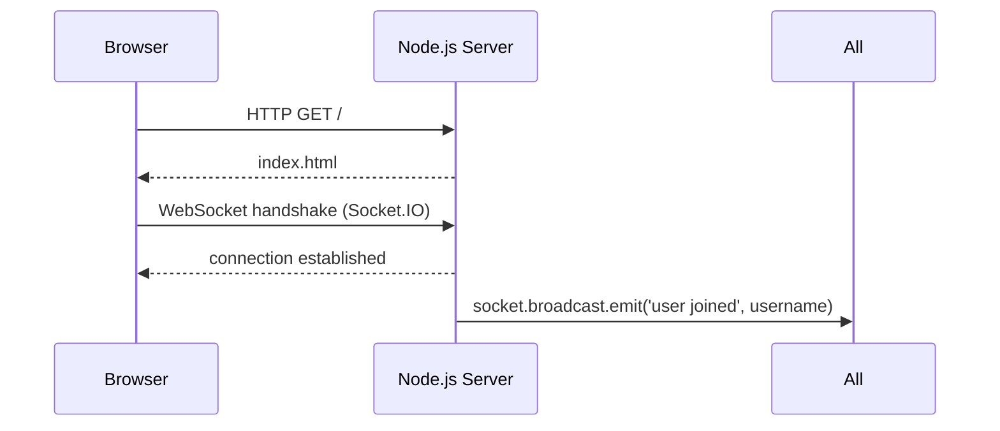

# Design Document: Discord-Like Chat Website

## Overview

A lightweight, real-time chat web application built with Node.js, Express, and Socket.IO. Users open the site, pick a username, and immediately start sending and receiving messages with everyone else connected — no accounts, no database required to get started.

The architecture is intentionally simple: a single-page frontend communicates with a Node.js server over WebSockets. This makes it easy to understand, extend, and deploy.

## Architecture



The server is the single source of truth for active connections. All messages flow through it — a client sends a message, the server receives it and broadcasts it to every connected client (including the sender).

## Sequence Diagrams

### Sending a Message



### User Connects



## Components and Interfaces

### Frontend: Single Page (index.html + client.js)

**Purpose**: Renders the chat UI and manages the Socket.IO client connection.

**Responsibilities**:
- Prompt user for a username on first load
- Display incoming messages in the chat window
- Send messages to the server on form submit
- Visually distinguish the current user's messages from others
- Show join/leave notifications

**Key DOM structure**:
```html
<div id="app">
  <header><!-- App name --></header>
  <ul id="messages"><!-- Message list --></ul>
  <form id="message-form">
    <input id="message-input" autocomplete="off" />
    <button type="submit">Send</button>
  </form>
</div>
```

**Client-side Socket.IO interface**:
```javascript
// Emit
socket.emit('set username', username)
socket.emit('chat message', { text: string })

// Listen
socket.on('chat message', (payload) => { /* render message */ })
socket.on('user joined', (username) => { /* show notification */ })
socket.on('user left', (username) => { /* show notification */ })
```

---

### Backend: Express + Socket.IO Server (server.js)

**Purpose**: Serves the static frontend and manages all real-time WebSocket events.

**Responsibilities**:
- Serve `index.html` via Express
- Accept Socket.IO connections
- Store the username associated with each socket
- Broadcast chat messages to all connected clients
- Emit join/leave events on connect/disconnect

**Server-side Socket.IO interface**:
```javascript
// Listen
socket.on('set username', (username) => { /* store on socket */ })
socket.on('chat message', ({ text }) => { /* broadcast to all */ })
socket.on('disconnect', () => { /* broadcast user left */ })

// Emit
io.emit('chat message', { username, text, timestamp })
io.emit('user joined', username)
io.emit('user left', username)
```

## Data Models

### Message Payload

```javascript
{
  username: string,   // Display name of the sender
  text: string,       // Message content (non-empty)
  timestamp: number   // Unix ms timestamp, added by server
}
```

### Socket Metadata (server-side, in-memory)

```javascript
// Stored on each socket object
socket.username = string  // Set after 'set username' event
```

No persistent storage — all state lives in memory and resets when the server restarts.

## Error Handling

### Empty Message
- **Condition**: User submits the form with blank input
- **Response**: Client-side validation prevents emit; input gets focus back
- **Recovery**: No server involvement needed

### No Username Set
- **Condition**: Client emits `chat message` before setting a username
- **Response**: Server falls back to `"Anonymous"` as the display name
- **Recovery**: Graceful — message still broadcasts

### Client Disconnects
- **Condition**: Browser closes or loses network
- **Response**: Socket.IO fires `disconnect` on the server; server broadcasts `user left`
- **Recovery**: Automatic — other clients are notified, no action needed

### Server Restart
- **Condition**: Server process restarts
- **Response**: All in-memory messages are lost; clients reconnect automatically via Socket.IO reconnection logic
- **Recovery**: Clients see a fresh chat window on reconnect

## Testing Strategy

### Unit Testing
- Validate message payload structure (username non-empty, text non-empty, timestamp is a number)
- Test username fallback logic (`"Anonymous"` when no username is set)

### Integration / Manual Testing
- Open two browser tabs, send messages from each — verify both receive all messages
- Refresh one tab — verify the other sees a join notification
- Submit empty input — verify no message is sent

### Property-Based Testing (optional, future)
- For any sequence of `chat message` events, the order received by all clients should match the order the server processed them

## Performance Considerations

- No database queries on the hot path — all message handling is in-memory and synchronous within the event loop
- Socket.IO's default long-polling fallback ensures compatibility with environments that block WebSockets
- For scale beyond a single server, a Redis adapter for Socket.IO can be added later to share state across instances

## Security Considerations

- Sanitize message text on the client before rendering (use `textContent` instead of `innerHTML`) to prevent XSS
- Validate and trim username input; enforce a max length (e.g., 32 chars)
- Rate-limit message emissions per socket to prevent spam (can use a simple token bucket or a library like `socket.io-rate-limiter`)
- In production, serve over HTTPS/WSS

## Dependencies

| Package | Purpose |
|---|---|
| `express` | HTTP server and static file serving |
| `socket.io` | WebSocket abstraction (server-side) |
| `socket.io-client` | WebSocket client (loaded via CDN in browser) |

No database dependency for the initial version. MongoDB can be added later for message persistence.
